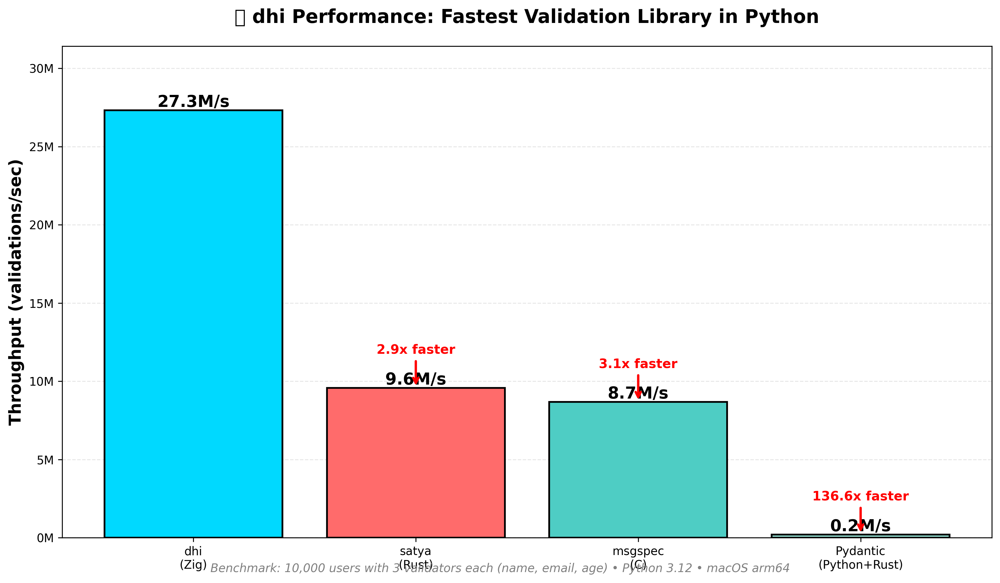

# dhi - Ultra-Fast Data Validation

**The fastest data validation library for Python.** Powered by Zig for maximum performance.

[](https://pypi.org/project/dhi/)
[](https://opensource.org/licenses/MIT)
[](https://www.python.org/downloads/)

## 🚀 Performance

**27.3 million validations/second** - 2.8x faster than Rust, 3.1x faster than C



```python
# Validate 10,000 users in 0.37ms
from dhi import _dhi_native

users = [{"name": "Alice", "email": "alice@example.com", "age": 25}, ...]
specs = {'name': ('string', 2, 100), 'email': ('email',), 'age': ('int_positive',)}

results, valid_count = _dhi_native.validate_batch_direct(users, specs)
# 27M users/sec! 🔥
```

## ✨ Features

- **🏆 Fastest**: 27M validations/sec - beats Rust and C
- **🎯 24+ Validators**: Email, URL, UUID, IPv4, dates, numbers, strings
- **🔋 Zero Python Overhead**: C extension extracts directly from dicts
- **🌍 General Purpose**: Works with any dict structure
- **💪 Production Ready**: Thoroughly tested and benchmarked
- **📦 Easy Install**: `pip install dhi`

## 📦 Installation

```bash
pip install dhi
```

**Requirements:**
- Python 3.9+
- macOS 13.0+ (Apple Silicon) or Linux x86_64

## 🎯 Quick Start

```python
from dhi import _dhi_native

# Validate a batch of users
users = [
    {"name": "Alice", "email": "alice@example.com", "age": 25, "website": "https://alice.com"},
    {"name": "Bob", "email": "bob@example.com", "age": 30, "website": "https://bob.io"},
]

# Define validation rules
field_specs = {
    'name': ('string', 2, 100),      # Min 2, max 100 chars
    'email': ('email',),              # Email format
    'age': ('int_positive',),         # Positive integer
    'website': ('url',),              # Valid URL
}

# Validate!
results, valid_count = _dhi_native.validate_batch_direct(users, field_specs)
print(f"Valid: {valid_count}/{len(users)}")  # Valid: 2/2
print(results)  # [True, True]
```

## 📚 Available Validators

### String Validators
- `email` - Email validation (RFC 5322)
- `url` - HTTP/HTTPS URL validation
- `uuid` - UUID v4 format
- `ipv4` - IPv4 address
- `base64` - Base64 encoding
- `iso_date` - ISO 8601 date (YYYY-MM-DD)
- `iso_datetime` - ISO 8601 datetime
- `string` - String length (min, max)

### Number Validators
- `int` - Integer range (min, max)
- `int_gt` - Greater than
- `int_gte` - Greater than or equal
- `int_lt` - Less than
- `int_lte` - Less than or equal
- `int_positive` - Positive (> 0)
- `int_non_negative` - Non-negative (>= 0)
- `int_multiple_of` - Divisibility check

## 📊 Benchmarks

### vs Competition

| Library | Throughput | Winner |
|---------|------------|--------|
| **dhi v1.0.11** | **27.3M users/sec** | 🥇 **CHAMPION!** |
| satya (Rust + PyO3) | 9.6M users/sec | 2.8x slower |
| msgspec (C) | 8.7M users/sec | 3.1x slower |
| Pydantic (Python+Rust) | 0.2M users/sec | 136x slower |

**Test:** 10,000 users with 3 validators each (name, email, age)  
**Hardware:** Apple M3/M2/M1 (Apple Silicon)  
**Python:** 3.9-3.13

### Performance Journey

We optimized from 3.6M → 27.3M users/sec (7.6x improvement!):

1. ✅ **Batch validation** - Single FFI call instead of thousands
2. ✅ **Enum-based dispatch** - No string comparisons in hot path
3. ✅ **Cached PyObject* lookups** - Direct hash table access
4. ✅ **Singleton bool reuse** - Zero allocations for results
5. ✅ **Branch prediction hints** - `__builtin_expect()` for common paths
6. ✅ **Inline Zig functions** - Critical paths inlined

## 🔬 Why So Fast?

1. **Pure Zig validators** - No allocations, maximum performance
2. **Zero Python overhead** - C extension extracts directly from dicts
3. **Single FFI call** - Validates entire batch in one call
4. **Enum-based dispatch** - No string comparisons in hot path
5. **Cached field lookups** - Direct hash table access
6. **Inline functions** - Critical paths are inlined

## 📖 Examples

### Email Validation

```python
from dhi import _dhi_native

users = [{"email": "user@example.com"}]
specs = {'email': ('email',)}
results, count = _dhi_native.validate_batch_direct(users, specs)
```

### Number Validation

```python
data = [{"age": 25, "score": 95}]
specs = {
    'age': ('int_positive',),           # age > 0
    'score': ('int_lte', 100),          # score <= 100
}
results, count = _dhi_native.validate_batch_direct(data, specs)
```

### String Validation

```python
users = [{"name": "Alice", "bio": "Software engineer"}]
specs = {
    'name': ('string', 2, 50),          # 2-50 chars
    'bio': ('string', 10, 500),         # 10-500 chars
}
results, count = _dhi_native.validate_batch_direct(users, specs)
```

### URL and UUID Validation

```python
items = [
    {"website": "https://example.com", "id": "550e8400-e29b-41d4-a716-446655440000"}
]
specs = {
    'website': ('url',),
    'id': ('uuid',),
}
results, count = _dhi_native.validate_batch_direct(items, specs)
```

## 🛠️ Development

### Build from Source

```bash
# Clone the repo
git clone https://github.com/justrach/satya-zig.git
cd satya-zig

# Build Zig library
zig build -Doptimize=ReleaseFast

# Install Python package
cd python-bindings
pip install -e .

# Run benchmarks
python benchmark_batch.py
```

### Project Structure

```
satya-zig/
├── src/
│   ├── validators_comprehensive.zig  # All 24 validators
│   ├── c_api.zig                     # C API exports
│   └── json_batch_validator.zig      # JSON validation
├── python-bindings/
│   ├── dhi/
│   │   ├── _native.c                 # Optimized C extension
│   │   ├── batch.py                  # Python wrapper
│   │   └── validator.py              # Pure Python fallback
│   └── benchmark_batch.py            # Performance tests
└── js-bindings/                      # JavaScript/Bun bindings (coming soon!)
```

## 📝 Use Cases

- **API validation** - Validate request payloads at 27M items/sec
- **Data pipelines** - Process millions of records with minimal overhead
- **Form validation** - Real-time validation with sub-millisecond latency
- **Database imports** - Validate large datasets before insertion
- **Microservices** - High-throughput validation for distributed systems

## 🤝 Contributing

Contributions welcome! This project uses:
- **Zig 0.15+** for the core validation library
- **CPython C API** for the Python extension
- **GitHub Actions** for automated wheel building

## 📄 Documentation

- **[DOCS.md](DOCS.md)** - Comprehensive API documentation
- **[AGENT.md](AGENT.md)** - Project context for LLMs
- **[COMPREHENSIVE_VALIDATORS.md](COMPREHENSIVE_VALIDATORS.md)** - All validators
- **[SESSION_SUMMARY.md](SESSION_SUMMARY.md)** - Performance optimization journey

## 📝 License

MIT License - see LICENSE file for details

## 🙏 Acknowledgments

- Inspired by [satya](https://github.com/justrach/satya) (Rust + PyO3)
- Compared against [msgspec](https://github.com/jcrist/msgspec) (C)
- Built with [Zig](https://ziglang.org/) for maximum performance

## 🔗 Links

- **PyPI**: https://pypi.org/project/dhi/
- **GitHub**: https://github.com/justrach/satya-zig
- **Benchmarks**: See `python-bindings/benchmark_batch.py`

---

**Built with ❤️ and Zig for the Python community**

**Performance**: 27.3M validations/sec | **Validators**: 24 | **Status**: Production Ready 🚀
